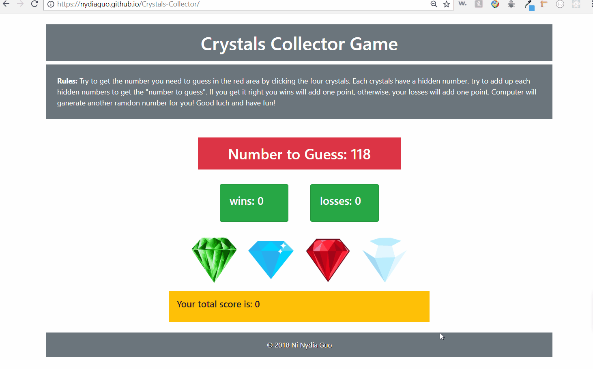

# week-4-game
## What is this game about?
Crystal Collector is a clicking game that built with jQuery and JavaScript. Each time the player needs to guess add up the four crystals' value(hidden numbers) to get the right number in the red area. Once the player doesn't get the right one, computer is going to run another random number.

## Scren shots

## Technoogies used
- [jQuery](https://jquery.com/)
- [Bootstrap](https://getbootstrap.com/)